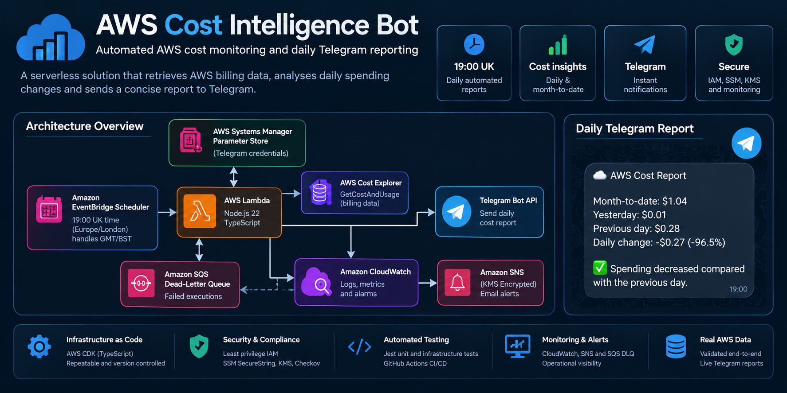
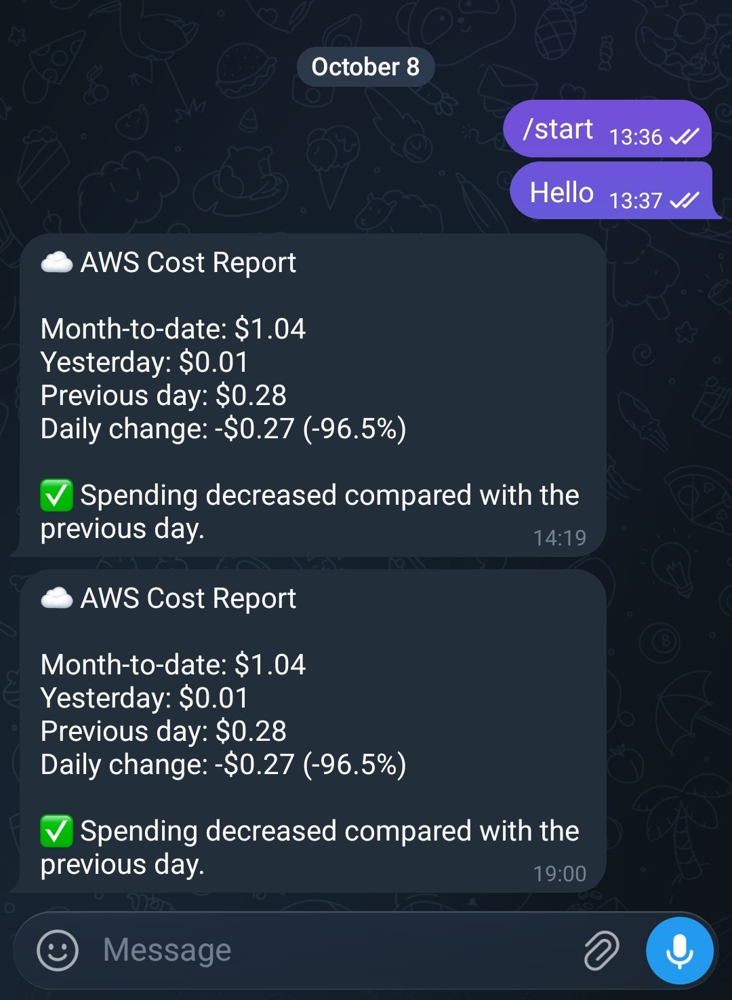

# AWS Cost Intelligence Bot

A serverless AWS cost monitoring solution that automatically analyses cloud spending and delivers daily cost reports to Telegram.

Built with **TypeScript, AWS CDK and AWS Lambda**, the project demonstrates automated cost reporting, Infrastructure as Code, secure credential management, operational monitoring and CI/CD security validation.

The bot runs every day at **19:00 UK time**, retrieves AWS billing data from Cost Explorer, calculates spending changes and sends a formatted Telegram report.

## 🔎 Project at a Glance



## 🧰 Tech Stack


## 🏗️ Architecture

The application uses an event-driven AWS architecture.

```text
EventBridge Scheduler (19:00 UK)
              |
              v
       AWS Lambda
              |
       +------+------+
       |             |
       v             v
  Cost Explorer   SSM Parameter Store
       |             |
       +------+------+
              |
              v
        Telegram Bot API

Operational monitoring:
Lambda / SQS DLQ → CloudWatch Alarms
                         |
                         v
                  KMS-encrypted SNS
                         |
                         v
                   Email Alerts
```

EventBridge Scheduler uses the `Europe/London` timezone, automatically handling GMT/BST changes.

## ⚖️ Design Decisions

| Decision | Reason |
|---|---|
| Serverless architecture | Minimal infrastructure management and low operational overhead |
| AWS CDK | Repeatable, version-controlled infrastructure using TypeScript |
| SSM SecureString | Keeps Telegram credentials outside application source code |
| EventBridge Scheduler | Reliable daily scheduling with UK timezone support |
| SQS dead-letter queue | Retains failed asynchronous Lambda events for investigation |
| CloudWatch and SNS | Provides operational monitoring and email alerts |

## 🔄 CI/CD & Security

GitHub Actions provides automated validation, including TypeScript compilation, Jest tests and security scanning.

Security controls include:

- Least-privilege IAM permissions
- Telegram credentials stored in SSM SecureString
- KMS encryption for SNS notifications
- SQS server-side encryption
- Checkov Infrastructure as Code scanning
- Gitleaks secret scanning
- CloudWatch monitoring and alerting

## 📊 Daily Cost Reports

Every day, the bot reports:

- Yesterday's AWS spending
- Previous day's AWS spending
- Daily cost difference
- Percentage increase or decrease
- Month-to-date AWS spending


<h2>📊 Telegram Report — Live Evidence</h2>

<table>
  <tr>
    <td width="45%" valign="middle">
      <h3>☁️ AWS Cost Intelligence Bot</h3>
      <p>
        Automated AWS spending insights delivered directly
        to Telegram every day at <b>19:00 UK time</b>.
      </p>
      <p>
        ✅ Month-to-date spending<br>
        ✅ Daily cost comparison<br>
        ✅ Percentage change<br>
        ✅ Automated delivery<br>
        ✅ Live AWS billing data
      </p>
      <p><b>Status:</b> Deployed and operational</p>
    </td>
    <td width="55%" align="center">
      
    </td>
  </tr>
</table>

The first scheduled end-to-end execution completed successfully on **8 October 2026 at 19:00 UK time**.

CloudWatch confirmed successful Lambda execution and Telegram delivery was independently verified.

## ✅ Testing & Validation

| Test | Result |
|---|---|
| TypeScript compilation | ✅ Passed |
| Jest unit and infrastructure tests | ✅ 17 passed |
| Checkov security scan | ✅ 38 passed, 0 failed |
| AWS CDK deployment | ✅ Successful |
| EventBridge scheduled execution | ✅ Verified |
| Telegram report delivery | ✅ Verified |
| CloudWatch SNS alarm notifications | ✅ Verified |

### 🧪 Automated Testing with Jest

Jest and **AWS CDK Assertions** provide automated testing of application logic and infrastructure configuration before deployment.

The project includes **17 automated tests**, covering cost calculations and AWS infrastructure validation to help identify regressions and configuration issues early.

Run tests locally:

```bash
npm test -- --runInBand
```

Tests are also executed automatically through GitHub Actions alongside TypeScript compilation, CDK synthesis, Checkov and Gitleaks security scanning.

**Validation results:**
- ✅ 17 automated tests passed
- ✅ TypeScript compilation successful
- ✅ CDK synthesis successful
- ✅ Checkov security scanning: 38 passed, 0 failed

Run the tests locally:

```bash
npm test -- --runInBand
```

This provides an additional quality gate alongside GitHub Actions CI/CD and infrastructure security scanning.

## 🧩 Challenges & Lessons Learned

| Challenge | Resolution |
|---|---|
| Lambda concurrency quota restriction | Removed reserved concurrency and documented the Checkov exception |
| Cost Explorer month-start date handling | Corrected UTC date boundaries and exclusive end-date handling |
| Encrypted SNS alarms | Configured KMS permissions for CloudWatch alarm publishing |
| GMT/BST scheduling | Used EventBridge Scheduler with `Europe/London` instead of fixed UTC |
| Production verification | Validated CloudWatch execution logs and real Telegram delivery |

## 🛠️ Deployment

### 1. Clone & Install

Requires Node.js 22, AWS CLI, configured AWS credentials and appropriate AWS deployment permissions.

```bash
git clone https://github.com/CloudRizz/aws-cost-intelligence-bot.git
cd aws-cost-intelligence-bot
npm ci
```

### 2. Configure Telegram

Create a Telegram bot using [@BotFather](https://t.me/BotFather) and send `/start` to your new bot.

Retrieve your chat ID by visiting:

```text
https://api.telegram.org/bot<BOT_TOKEN>/getUpdates
```

Locate `message.chat.id` in the JSON response.

Store your credentials securely in AWS Systems Manager Parameter Store:

```bash
read -rsp "Telegram bot token: " BOT_TOKEN
echo
read -rp "Telegram chat ID: " CHAT_ID

aws ssm put-parameter \
  --name "/cloudrizz/cost-bot/telegram/token" \
  --type SecureString --value "$BOT_TOKEN" \
  --region eu-west-2

aws ssm put-parameter \
  --name "/cloudrizz/cost-bot/telegram/chat-id" \
  --type SecureString --value "$CHAT_ID" \
  --region eu-west-2

unset BOT_TOKEN CHAT_ID
```

Parameter names must match those configured in the CDK application. The commands use Bash and create new parameters; existing parameters require updating with `--overwrite`.

### 3. Configure Email Alerts

Update the SNS notification email address in:

`lib/aws-cost-intelligence-bot-stack.ts`

Replace `hello@twrz.co.uk` with your preferred email address.

After deployment, confirm the AWS SNS subscription email to activate CloudWatch alarm notifications.

### 4. Test & Deploy

```bash
npm run build
npm test -- --runInBand
npx cdk synth

# Required once per AWS account/region if not already bootstrapped
npx cdk bootstrap

npx cdk deploy
```

Once deployed, EventBridge Scheduler automatically invokes the Lambda **daily at 19:00 UK time**, with GMT/BST adjustments handled through `Europe/London`.

> **Note:** This project deploys to `eu-west-2`. AWS charges may apply, including Cost Explorer API requests and the customer-managed KMS key. Never commit credentials to source control.

## 📝 Project Status

**V1 — Deployed and operational**

Successfully running automated AWS cost reports at 19:00 UK time.

The project demonstrates a complete serverless workflow, from infrastructure provisioning and security validation through to production monitoring and confirmed message delivery.